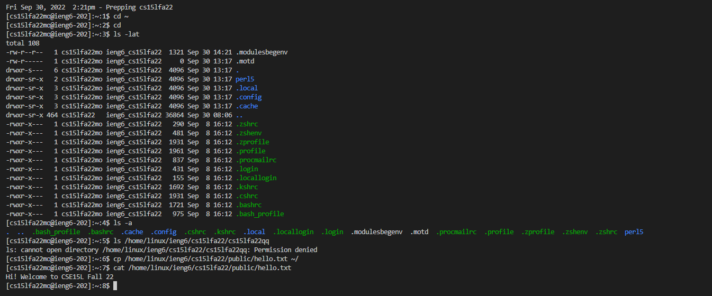

# Week 1 Lab Report
## How to Remotely Connect to ieng6 (Tutorial)

### Step 1 - Installing VScode

### Step 2 - Remotely Connecting

### Step 3 - Trying Some Commands

### Step 4 - Moving Files with scp

### Step 5 - Setting an SSH Key
![Image] ()

### Step 6 - Optimize Remote Running
![Image] ()
