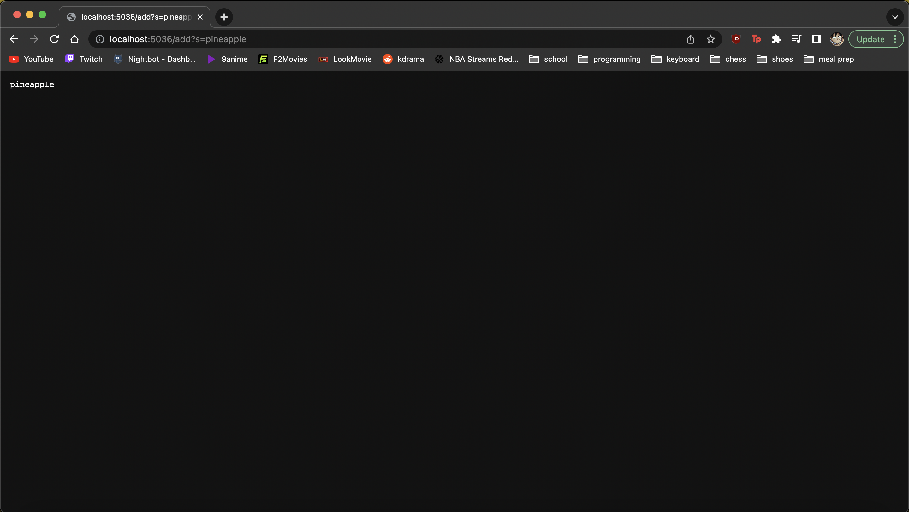
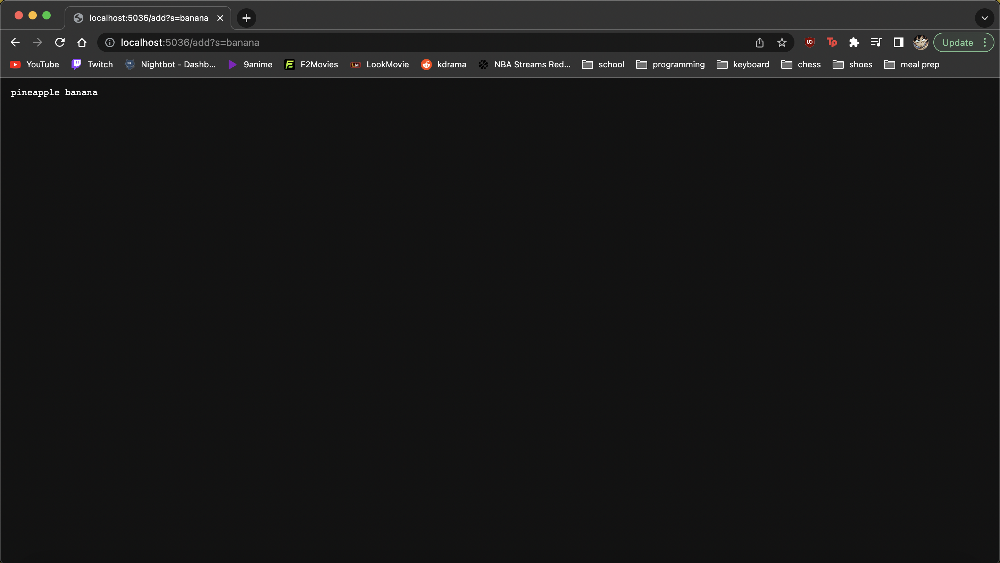
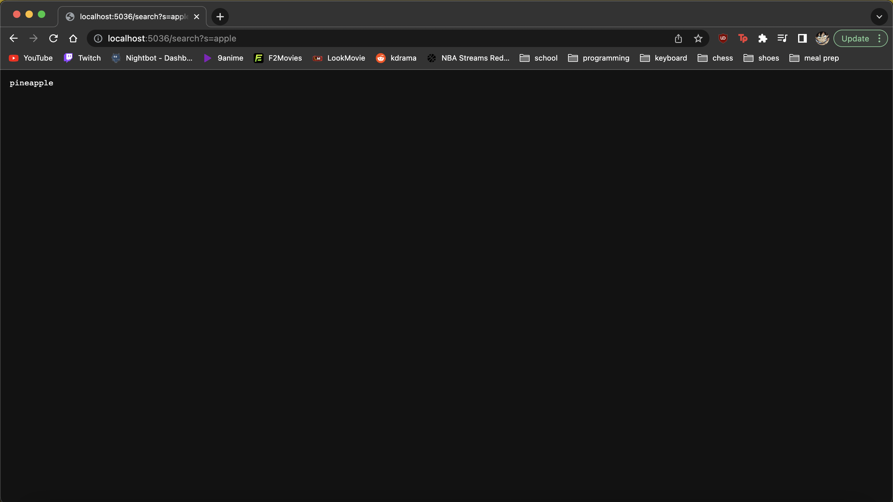

# Week 3 Lab Report

## Part 1 - Search Engine
```
import java.io.IOException;
import java.net.URI;
import java.util.ArrayList;

class Handler implements URLHandler{
    ArrayList<String> arr = new ArrayList<String>(10);
    ArrayList<String> alt = new ArrayList<String>(10);
    
    public String handleRequest(URI url) {
            if (url.getPath().equals("/")) {
                return "This is search engine.";
            }
            if (url.getPath().contains("/add")) {
                String[] parameters = url.getQuery().split("=");
                arr.add(parameters[1]);
                String empty = "";
                for (String s: arr) {
                    empty = empty + " " + s;
                }
                return empty;
            }
            else if (url.getPath().contains("/search")) {
                String[] parameters = url.getQuery().split("=");
                
                for(int i = 0; i < arr.size(); i++) {
                    if (arr.get(i).contains(parameters[1])) {
                        alt.add(arr.get(i));
                    }
                }
                String empty = "";
                for (String s: alt) {
                    empty = empty + " " + s;
                }
                return empty;
            }
        return "404 Not Found!";
    }
}

class SearchEngine {
    public static void main(String[] args) throws IOException {
        if(args.length == 0){
            System.out.println("Missing port number! Try any number between 1024 to 49151");
            return;
        }

        int port = Integer.parseInt(args[0]);

        Server.start(port, new Handler());
    }
}
```

* The method that is called is handleRequest.
* The relevant arguments are "/add" and "=". The argument will change from "/" to "/add", but the argument "=" will not change.
* The relevant fields are "arr", "parameters", and "empty". The "arr" field will change by adding the string "pineapple", the parameters field will change by becoming the string "pineapple", and the "empty" field will also change by adding the string "pineapple".


* The method that is called is handleRequest.
* The relevant arguments are "/add" and "=". The values of these arguments will not change.
* The relevant fields are "arr", "parameters", and "empty". The "arr" field will change by adding the string "banana", the parameters field will change by becoming the string "banana", and the "empty" field will also change by adding the string "banana".


* The method that is called is handleRequest.
* The relevant arguments are "/search" and "=". The values of these arguments will not change.
* The relevant fields are "alt", "parameters", and "empty". The "alt" field will change by adding the string "pineapple", the parameters field will change by becoming the string "apple", and the "empty" field will also change by adding the string "pineapple".


## Part 2 - Bugs

### ArrayExamples - averageWithoutLowest
* The failure inducing input was {1.0, 1.0, 2.0, 3.0, 4.0, 5.0}.
* The symptom was that the method averageWithoutLowest was returning a value of 3.5 when it should have been returning a value of 3.0.
* The bug was the method averageWithoutLowest was removing all the lowest values instead of a single copy of the lowest values. For example, it would remove both 1.0's in index 0 and 1 instead of one of them. In order to fix this bug, I changed the code to simply subtract the value of the lowest value one time and divide by the length of the array subtracted by 1.

### ListExamples - filter
* The failure inducing input was {"1", "2", "3"}.
* The symptom was that the method filter was returning {"3", "2"} when it should have been returning {"2", "3"}.
* The bug was that the method filter was not returning the filtered arraylist in the original order of the original arraylist. Therefore, I had to add an index value to maintain the order of the filtered arraylist.
