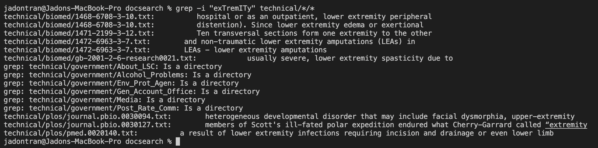
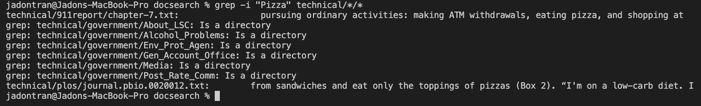
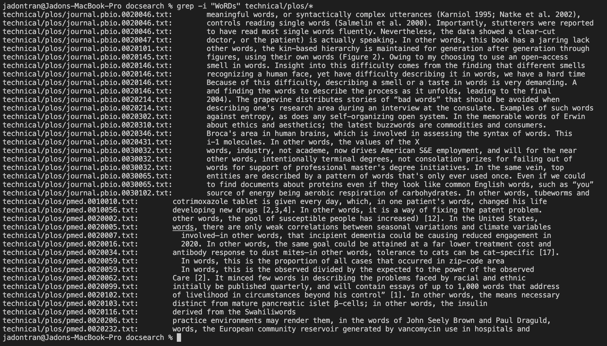
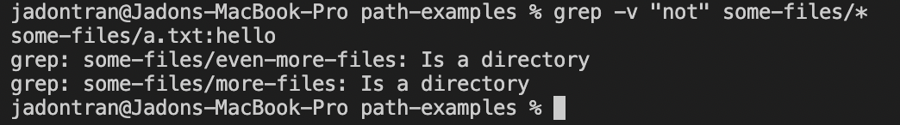
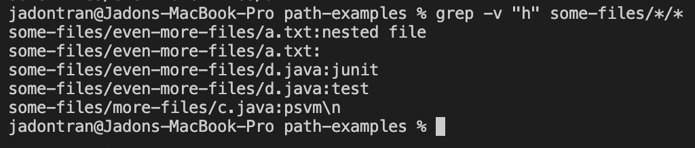
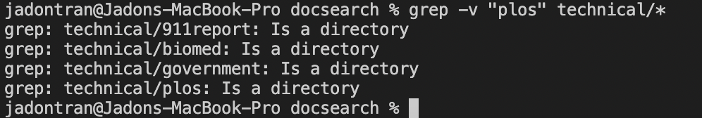
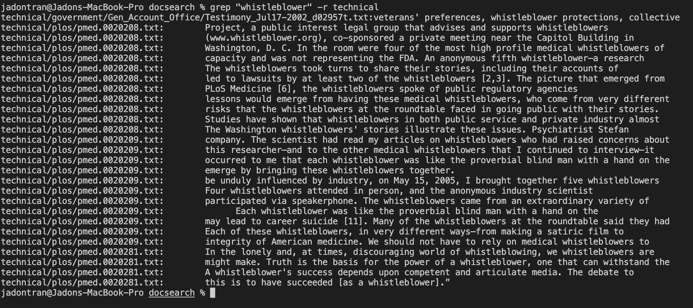
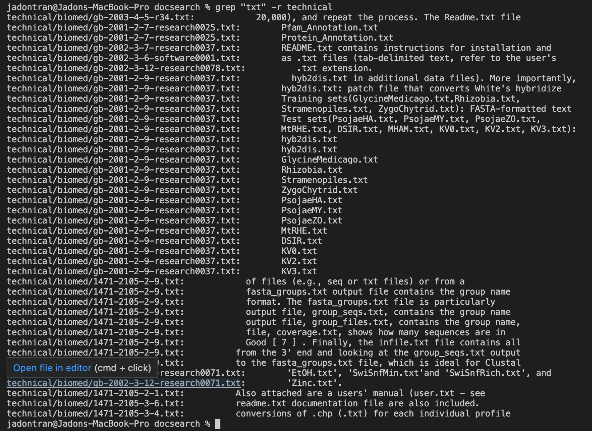
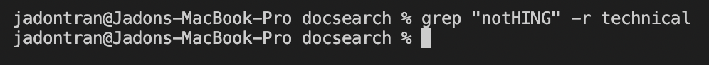

# Week 5 Lab Report

## `grep` Command

### Option 1: `-i`

The `-i` option command allows for you to search a following phrase or string regardless if it's uppercase or lowercase. It simply ignores the case sensitivity of the phrase or string you're trying to search.

#### Example 1 - `grep -i "exTremITy" technical/*/*`

The first example I've tested this on was the word "exTremITy" which I completely scrambled the case sensitivity on. Normally, there should be no words that have uppercase in the middle or scattered throughout the word, thus returning nothing. However, the `-i` command allows us to bypass this and search for any iteration of "extremity" throughout the files within technical.

#### Example 2 - `grep -i "Pizza" technical/*/*`

Another example would be "Pizza." This test demonstrates that if you accidentally capitalize the first letter by instinct or mistake, it will still search for all forms of "pizza" within the files in technical. It also highlights the difference between searching "Pizza" without `-i` and with because `grep` would not return iterations of "pizza" if the `-i` was not included within the command.

#### Example 3 - `grep -i "WoRDs" technical/plos/*`

Finally, the `-i` command can help specific scenarios in which you need to find a certain word or phrase within a particular directory. As shown through the command, we can pinpoint exactly where we would want to find "words" without case sensitivity within the files of plos instead of all the files in technical. This can prove to be very handy when we're searching for specific strings in a particular are we want.

### Option 2: `-v`

The `-v` command allows you to return the lines that don't contain the string or phrase given in the command-line. If you want to return all lines without a specific phrase, the `-v` command is perfect.

#### Example 4 - `grep -v "not" some-files/*`

For this test, we find all lines that do not contain the phrase "not" within it. To make things simpler, I tested the command on a smaller file which was some-files. It returned both text files and its contents that did not contain "not" and also directories whose names did not contain "not." The latter part may prove useful as displayed later.

#### Example 5 - `grep -v "h" some-files/*/*`

To remind yourself, this command `-v` can also prove useful because it may exclude not just words, but also merely letters or even also whole phrases. In some situations, this could help you find parts of a specific text file that do not contain a word or letter you may not want.

#### Example 6 - `grep -v "plos" technical/*`

Finally, we have shown that `-v` doesn't necessarily restrict itself to finding the contents of text files or text files themselves. We can utilize this command to exclude specific directories that we are not looking for. Here, we have found all directories within technical that are not "plos."

### Option 3: `-r`

The `-r` command is useful because it recursively searches throughout directory and its directories and files for us. This helps us eliminate the use of `technical/*/*` because `-r` does it for us already.

#### Example 7 - `grep "whistleblower" -r technical`

As you can see, we have searched throughout technical and its files for the phrase "whisteblower." It was much faster and simpler to type `-r technical` as opposed to `technical/*/*`. And yet, we received the same results.

#### Example 8 - `grep "txt" -r technical`

This command can also be useful if we're searching for txt files within techincal as well. The recursive command makes it easier for us to find all the types of a specific file within a huge directory.

#### Example 9 - `grep "nothing" -r technical`

Finally, this command can be used in a way to confirm that there are no words or files that we don't want in throughout our directory and its directory at all. Since we searched for "nothing" recursively in technical and nothing was returned, we have made sure that there are no iterations of "nothing" in any directories or files.

