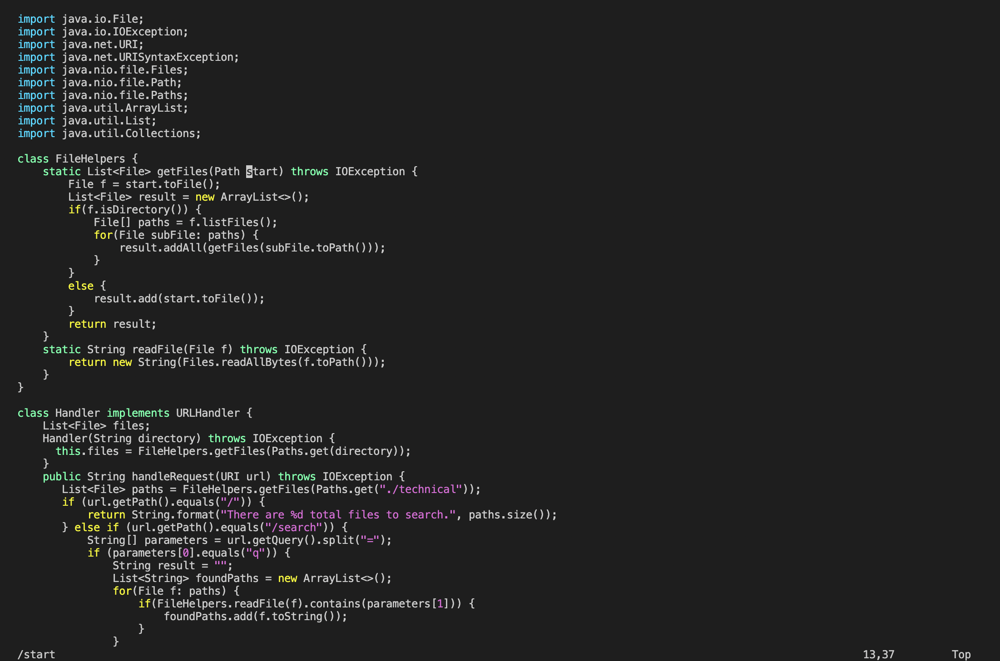
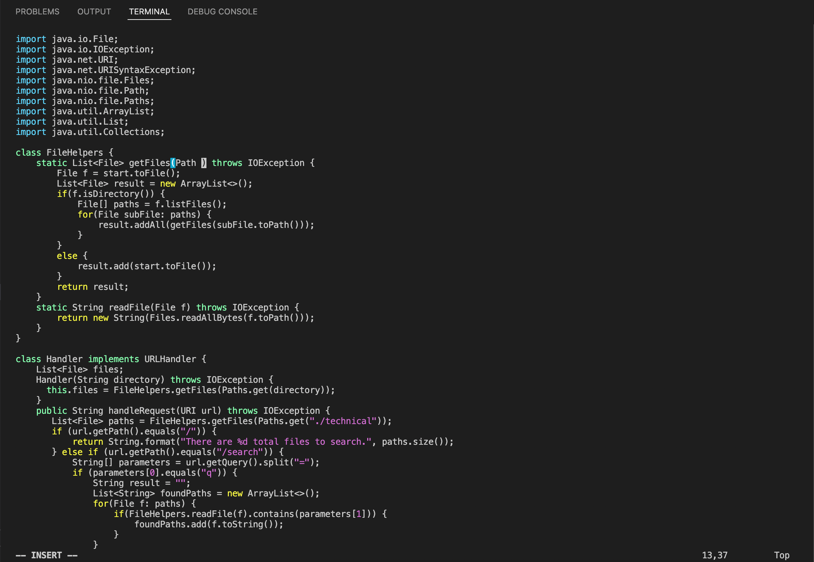
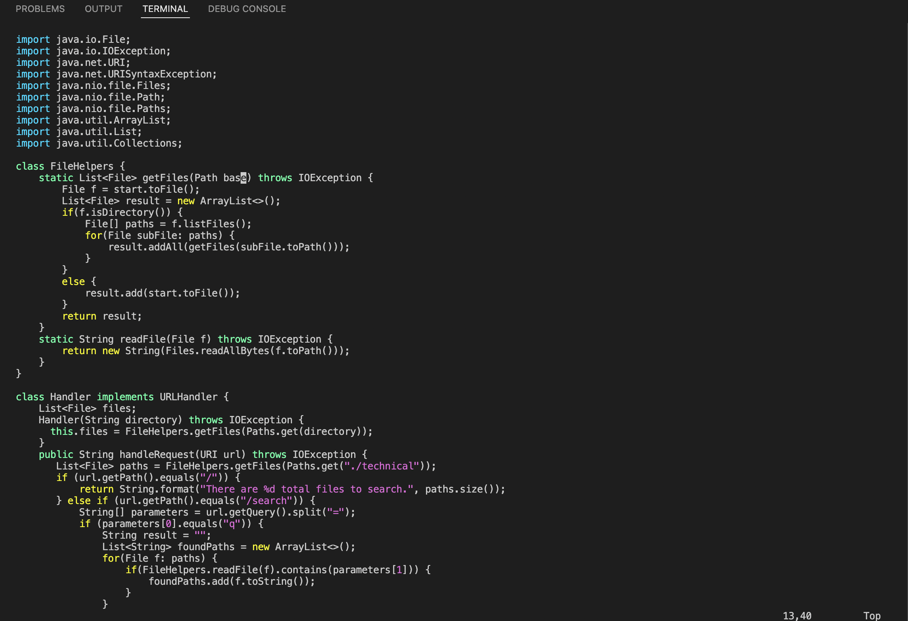
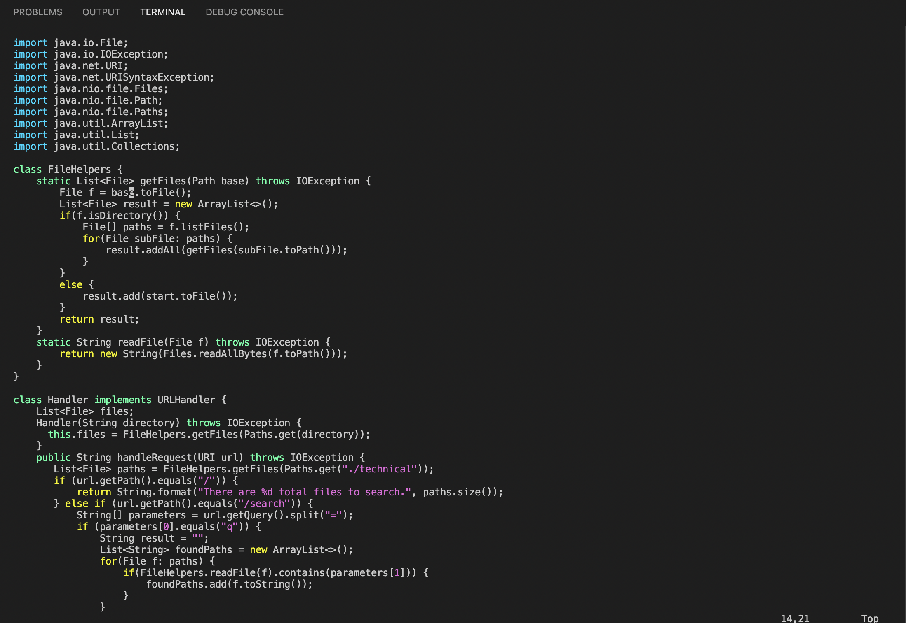

# Week 7 Lab Report

## Part 1

*Changing the name of the `start` parameter and its uses to `base`

*Step 1: `/start<ENTER>`

Firstly, we will use the `/start` to search for the first instance of start within the DocSearchServer.java. Since we open DocSearchServer.java with vim, we will start from the very beginning, which gives us the first instance of start when we search.

*Step 2: `C + e`

Next, we will proceed to edit the parameter name `start` to `base` by pressing `C + e`. This command will allow us to enter the insert mode, highlight the parameter `start`, and delete the parameter name `start`.

*Step 3: `b + a + s + e<ESC>`

Once the parameter name `start` is deleted, we can proceed to replace it with `base` by typing in `b + a + s + e`. After we're done replacing `start` with `base`, we can exit the insert mode by pressing `<ESC>`.

*Step 4: `n + .`

Although it may appear as though you would have to repeat a lot of steps to replace all the `start` parameters within the file, there's a simple shortcut using a function of the search command `n` and another command `.`. The `n` command will allow you to cycle to the next iteration of `start`, while the `.` function will simply repeat your last chain of commands, including `C + e` and `b + a + s + e<ESC>`. Therefore, you simply need to press `n + .` until all `start` parameter iterations have been replaced with `base`.

## Part 2

*Visual Studio Code vs Vim

Through Visual Studio, editing the DocSearchServer.java file on local and updating the file in the remote server took around 1:42 minutes. The tasks that were given were relatively simple changes, so the bulk of the process was opening the file and using commands to transfer the file into the directory needed to in the remote server. On the other hand, I was able to directly access the DocSearchServer.java file after logging onto the remote, and using the set of commands I displayed earlier above, I was able to quickly make the required changes in around 0:32 seconds, which is much faster than my process using Visual Studio.

*Conclusion

I can conclude that there are pros and cons for both Visual Studio and Vim. For Visual Studio, it would be better to make bigger changes or write most of your code simply because it is easier to and is more convenient in Visual Studio to manuever around and see errors. However, using Vim is significantly more faster and efficient for small changes or edits in files, especially on a remote server.
