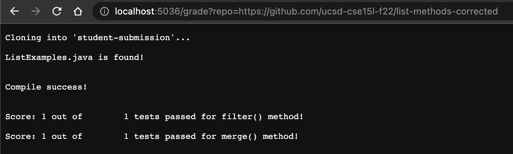
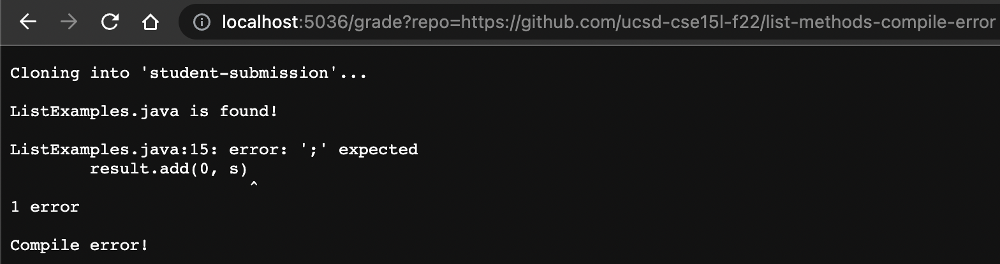
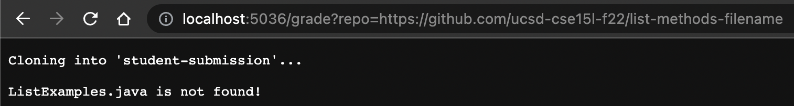

# Week 9 Lab Report

## Grading Script

[grade.sh](gradescript.md) 

## Student Submission Examples

### List Methods Corrected

This submission has the proper methods, therefore it will return a perfect score.

### List Methods Compile Error

This submission has a syntax error of missing a semicolon in a line, therefore it will simply return a "Compile error!" statement.

### List Methods Filename

This submission has the correct file with the wrong name, therefore it is not found and will return a "ListExamples.java is not found!" statement.

## Tracing Student Submission (Filename)

* 
* 
* 